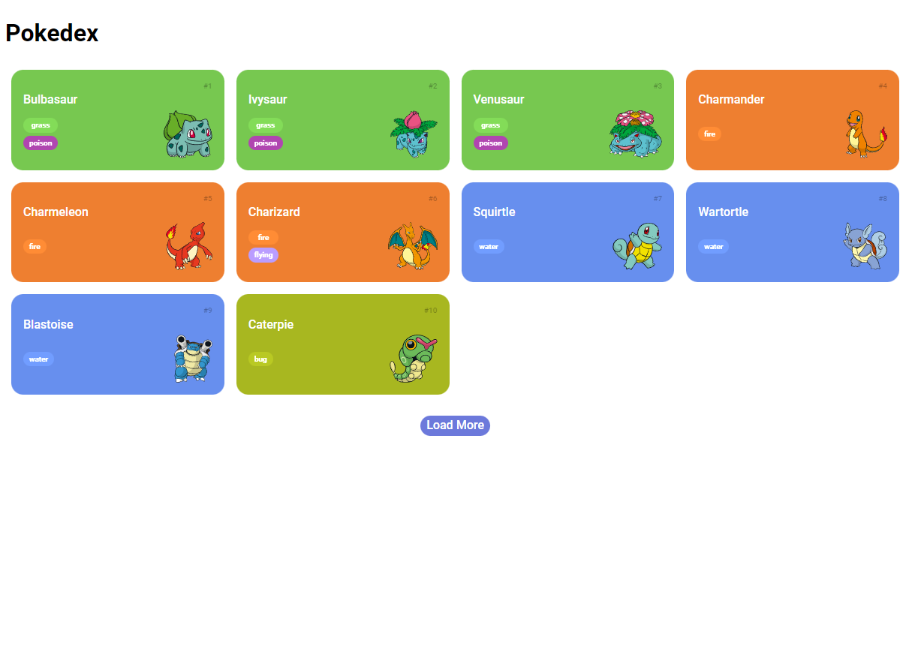
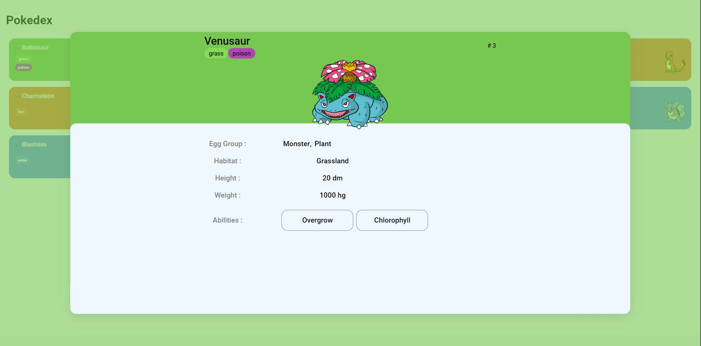
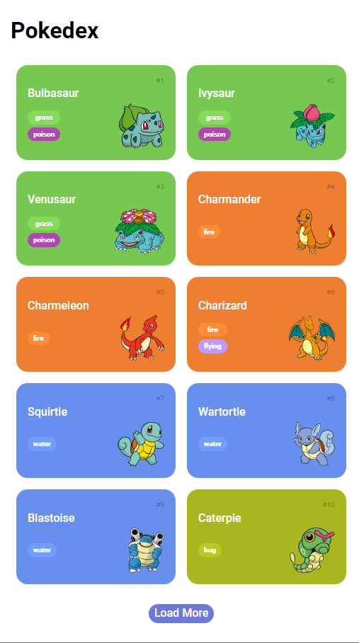
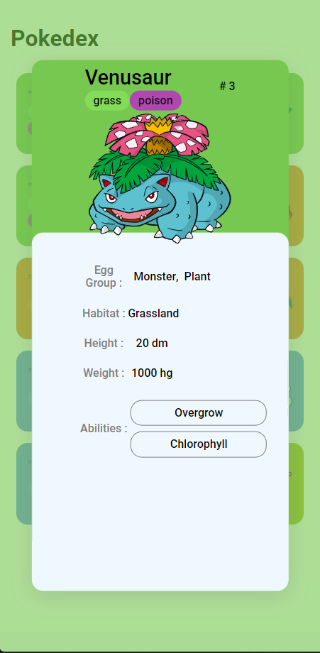

# Pokedex &nbsp; &nbsp; &nbsp;  &nbsp; 

This is a solution to Building a Pokédex with JavaScript from [Digital Innovation One](https://www.dio.me/en). Dio.me is the platform for you to learn from experts, master the main technologies and enter the most desired companies faster.

This Pokedex load all pokemons of first generation and when you click on a pokemon, some details about the chosen pokemon will appear.

  

<b>Build with:</b>  

## Table of contents

- [Overview](#overview)
  - [The challenge](#the-challenge)
  - [Project Composition](#project-composition)
  - [Screenshot](#screenshot)
  - [Links](#links)
- [My process](#my-process)
  - [Built with](#built-with)
  - [What I learned](#what-i-learned)
- [Useful Resources](#useful-resources)
- [Author](#author)

 

## Overview

### <b id="the-challenge">The challenge</b>
- The project goals was develop a pokedex that displays multiple pokemons and create a page that displays the details of the chosen pokemon.

### <b id="project-composition">Project Composition</b>
Done:
- Consume Pokemon RESTful API
- Build webpage dinamically
- Create pagination
- Limit to show only first generation Pokemons
- Create Pokemon Description page
- When you click on a pokemon, display the details of the chosen pokemon at middle of screen

### <b id="screenshot">Screenshot</b>

    
    
    
    

### <b id="links">Links</b>
- Solution URL: [GitHub Repository](https://github.com/bemibrando/pokedex/)
- Live Site URL: [GitHub Pages](https://bemibrando.github.io/pokedex/)

 

## My process

### <b id="built-with">Built with</b>
- Semantic HTML5 markup
- CSS custom properties
- Flexbox
- CSS Grid
- JavaScript
- PokeApi

### <b id="what-i-learned">What I learned</b>
- How to consume RESTful API
- How to manipulate the result of the request through a Promise
- How to use function Map to decrease code verbosity
- How to handle multiple requests in parallel
- How to convert PokeApi model to my model
- How to add subitems to HTML dinamically
- How to add pagination and remove the button when it reaches the limit

## <b id="useful-resources">Useful Resources</b>
- [Saepul Nahwan - Pokedex App](https://dribbble.com/shots/6540871-Pokedex-App) - This design was used as inspiration to develop this webpage.
- [Pokemon RESTful API](https://pokeapi.co/) - All the Pokémon data you'll ever need in one place,
easily accessible through a modern RESTful API.
- [DIO.me - Digital Innovation One](https://www.dio.me/en) - Dio.me is the platform for you to learn from experts, master the main technologies and enter the most desired companies faster.

## Author

    <figure>
        <a href="https://github.com/bemibrando" target="_blank">
              
            <b>Bianca Emi</b>
        </a>
    </figure>
    
Made with ♥ by <a href="https://github.com/bemibrando" target="_blank">Bianca Emi</a> 👋 Get in touch!

    

           
           
         
    

